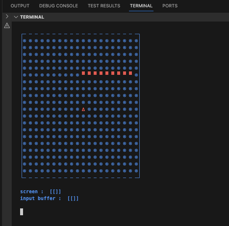
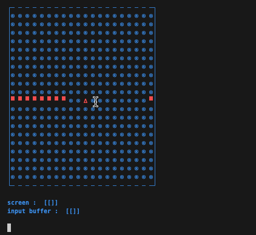

# Quick and simplish Terminal Snake Game
Quickly made to test out a RL model idea in progress

## View

## Start
No external dependencies needed
start with 
<!-- `$ `  -->
`python game.py`

## Movement
`a s d w` movement, left, right, down and up respectively

